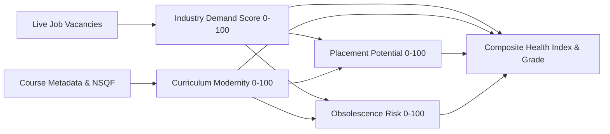

# Simplified Government Dashboard & KPI Architecture Guide

**SIH PS 26134** | *Challenges in Aligning Skill Development Programs with Industry Requirements and Emerging Job Market Demands*  
*Government of Maharashtra — Labour Market Intelligence & Skill Alignment Platform*

---

## 🎯 Executive Summary of Simplification

To eliminate cognitive overload for government officials, university board evaluators, and skill mission directors, the entire dashboard and intelligence architecture has been streamlined around a single design philosophy:

> **Every KPI directly answers an executive policy question in under 10 seconds.**

The dashboard is structured into **three focused tabs**:
1. **Labor Market Intelligence** $\to$ *Where are jobs growing and what do employers pay?*
2. **Skill Development Courses** $\to$ *What training courses exist and at what capacity?*
3. **Generate Reports (Curriculum Gaps)** $\to$ *Which skills are missing, and what new courses must we create?*

---

## 📊 Tab 1: Labor Market Intelligence (`AnalysisView`)

### Core Decision: *Identify state and district employment hotspots.*

```
┌──────────────────────────────┬──────────────────────────────┬──────────────────────────────┐
│    TOTAL ACTIVE OPENINGS     │     TOP EMPLOYMENT HUB       │   STATEWIDE BENCHMARK SALARY │
│          18,450              │            Pune              │           ₹5.8L              │
│  Across 36 Districts         │ Lead Regional Hiring Center  │ Annual Market Average        │
└──────────────────────────────┴──────────────────────────────┴──────────────────────────────┘
```

### Simplified KPIs Breakdown:

1. **Total Active Openings (Vacancies)**:
   * **What it means**: The total count of verified active job postings across Maharashtra (or the selected district).
   * **How it's accessed**: `GET /api/v1/jobs/districts/heatmap` (Statewide) or `GET /api/v1/jobs/districts/demand?district={name}` (District).
   * **Behind the scenes**: Queried from the live Adzuna ingestion pipeline and cached in Redis with an hourly TTL.

2. **Top Employment Hub / Demand Score (/100)**:
   * **What it means**: For statewide view, the district with the highest hiring volume; for a district view, the normalized hiring intensity ($0–100$).
   * **How it's accessed**: Calculated as $\text{Demand Score} = \min\left(100, \max\left(15, \frac{\text{District Weight}}{1.6} \times 100\right)\right)$.

3. **Benchmark Salary**:
   * **What it means**: Mean annual compensation offered in INR.
   * **How it's accessed**: Mean of minimum and maximum salary postings in `GET /api/v1/jobs/districts/demand`.

---

## 📚 Tab 2: Skill Development Courses (`CourseView`)

### Core Decision: *Audit the government's current training inventory.*

```
┌──────────────────────────────┬──────────────────────────────┬──────────────────────────────┬──────────────────────────────┐
│   TOTAL COURSES CATALOGUED   │      STUDENT ENROLLMENTS     │      TRAINING PROVIDERS      │    SECTORS & PRICING         │
│            4,124             │           342,180            │             128              │              38              │
│    2,890 Online · 1,234 Offline│ Across all registered users  │ NSDC / SID certified         │ 3,210 Free · 914 Subsidized  │
└──────────────────────────────┴──────────────────────────────┴──────────────────────────────┴──────────────────────────────┘
```

### Simplified KPIs Breakdown:

1. **Total Courses Catalogued**:
   * **What it means**: Total active courses in Skill India Digital (SID) with Online vs. In-Center breakdown.
   * **How it's accessed**: `GET /api/v1/courses/stats` $\to$ `total_courses`, `online_courses`, `offline_courses`.

2. **Total Student Enrollments**:
   * **What it means**: Candidate registrations across all state vocational and university courses.
   * **How it's accessed**: `GET /api/v1/courses/stats` $\to$ `total_enrollments`.

3. **Certified Training Providers**:
   * **What it means**: Number of distinct NSDC, ITI, and polytechnic training centers.
   * **How it's accessed**: `GET /api/v1/courses/stats` $\to$ `unique_providers`.

4. **Sectors Covered (Free vs. Subsidized)**:
   * **What it means**: Distinct industry sectors and availability of free state-funded vs paid courses.
   * **How it's accessed**: `GET /api/v1/courses/stats` $\to$ `unique_sectors`, `free_courses`, `paid_courses`.

---

## 📋 Tab 3: Curriculum Gap & Intelligence Reports (`GenerateReportsView`)

### Core Decision: *Pinpoint unmet industry skills and generate blueprints for new courses.*

```
┌──────────────────────────────┬──────────────────────────────┬──────────────────────────────┬──────────────────────────────┐
│    ACTIVE SECTOR VACANCIES   │      CATALOGUED COURSES      │    MARKET SKILL COVERAGE     │   BENCHMARK SECTOR SALARY    │
│            1,850             │              80              │             88%              │           ₹7.1L              │
│  In Selected District Scope  │ 1 Course per 23 Vacancies    │ 3 Unmet Skill Gaps Found     │ Annual Market Average        │
└──────────────────────────────┴──────────────────────────────┴──────────────────────────────┴──────────────────────────────┘
```

### Simplified KPIs Breakdown:

1. **Active Sector Vacancies**:
   * **What it means**: Total live job openings in the selected sector and district (e.g. *Automotive in Pune*).
   * **How it's accessed**: `GET /api/v1/reports/sector-curriculum-intelligence?sector_name=...&district=...`.

2. **Catalogued Courses & Supply Ratio**:
   * **What it means**: Number of courses available vs the job market ratio (e.g., *1 Course per 23 active jobs*).

3. **Market Skill Coverage % & Unmet Gaps**:
   * **What it means**: Percentage of skills required by employers that are taught in existing courses. Highlights missing competencies requiring **New Course Blueprints**.

4. **Benchmark Sector Salary**:
   * **What it means**: Industry compensation benchmark for the selected domain.

---

## 🔍 Individual Course Health Report (`/gov/course/:id`)

### Core Decision: *Decide whether to scale, refresh, or phase out an individual course.*

```
       ┌────────────────────────┐
       │   COURSE HEALTH INDEX  │
       │       87 / 100         │
       │  Grade A · Highly Aligned│
       └────────────────────────┘
```

### 4 Core Supporting Metrics:
1. **Industry Demand Score**: $98\%$ $\to$ Based on $784$ active live vacancies in Maharashtra.
2. **Market Compensation**: ₹$16.0$L $\to$ Entry (₹$4.0$L) to Senior (₹$30.0$L) spectrum.
3. **Curriculum Modernity**: $69\%$ $\to$ Contemporary standards and NSQF level integration.
4. **Obsolescence Risk**: $15\%$ $\to$ Low risk of becoming obsolete.

---

## 📐 Mathematical Calculation Pipeline



### 1. Composite Health Index Formula
$$H_{\text{composite}} = (0.35 \times S_{\text{demand}}) + (0.25 \times S_{\text{modernity}}) + (0.25 \times S_{\text{placement}}) + (0.15 \times (100.0 - S_{\text{obsolescence}}))$$

### 2. Obsolescence Risk Formula
$$S_{\text{obsolescence}} = \max\left(5.0, \min\left(85.0, 100.0 - (0.55 \times S_{\text{demand}} + 0.45 \times S_{\text{modernity}})\right)\right)$$

### 3. Grading Standard
* **Grade A ($\ge 85$)**: Optimal Alignment $\to$ Scale seat capacity in high-demand districts.
* **Grade B ($70 - 84$)**: Strong Alignment $\to$ Embed emerging practical lab modules.
* **Grade C ($55 - 69$)**: Moderate Alignment $\to$ Curriculum refresh required.
* **Grade D ($< 55$)**: High Obsolescence Risk $\to$ Overhaul or phase out.
